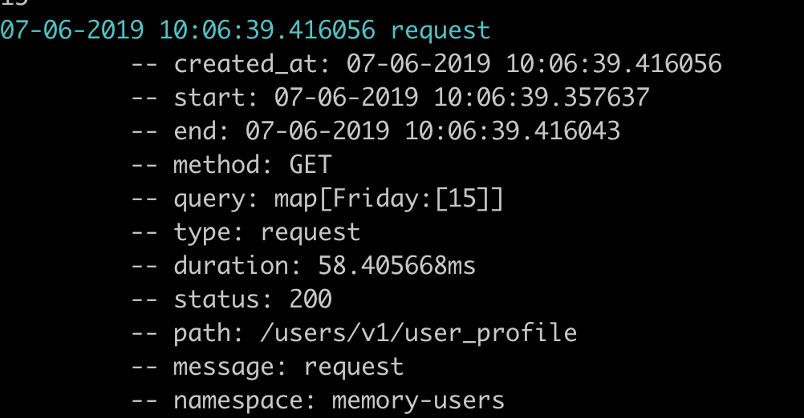

Logger
=======

A structured logging package for memory microservices.

## Example Usage

The logger can print lines in either coloured readable logs, or json machine readable logs. If you provide the logger
with a redis connection, it will allow structured logging.

```go
func main() {
    logger.SetNamespace("my-app")
    logger.SetVersion("v1")

    redisClient := redis.NewClient(&redis.Options{
        Addr:     os.Getenv("REDIS_HOST"),
        Password: os.Getenv("REDIS_PASSWORD"),
    })

    logger.SetStreamLogger(redisClient)
}
```

### Log Levels

There are three log levels on the logger; trace, ok and error.

#### Error

Error takes in an error type along with optional variables as follows:

```go
err := errors.New("my test error")

logger.Error(err, logger.Data{
    "category_id": 3,
    "user_id": 15,
    "question": "What colour is the sky?",
})
```

These logs are printed in red.

### Trace

Trace takes in a string along with optional variables, and prints logs in blue:

```go
logger.Trace("new user inserted", logger.Data{
    "category_id": 3,
    "user_id": 15,
    "question": "What colour is the sky?",
})
```

### OK

OK takes in a string along with optional variables, and prints logs in green:

```go
logger.OK("action completed", logger.Data{
    "category_id": 3,
    "user_id": 15,
    "question": "What colour is the sky?",
})
```

### Request

The logger also contains some middleware to log http request metrics. If you wrap your http handler in the middleware it will log the request.

```go
r.Path("/users/v1/weekly-report").Methods("GET", "OPTIONS").Handler(chainWithXRay(svc.WeeklyProgressHandler, "/users/v1/weekly-report", logger.Handler, cors, mw.RateLimit))
```

### Output

